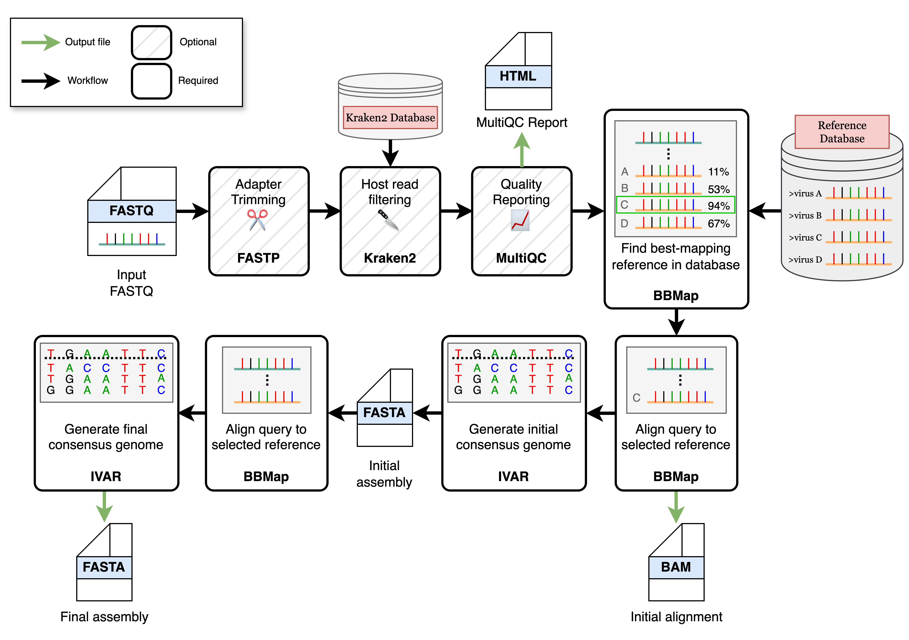

# REVICA - Influenza

This repository is a fork of [the Greninger Lab's REVICA pipeline](https://github.com/greninger-lab/revica) intended for assembly of influenza consensus genomes.  

This fork is usable with any influenza reference database, but includes the one used used in the [Andersen Lab's avian influenza project](https://github.com/andersen-lab/avian-influenza) (`reference.fasta`).

Added features include:
- automatic merging of segment files (consensus fasta and alignment BAM) per sample
- replacement of FastQC with MultiQC for streamlined reporting

The final output files can be found in `<work_folder, default=run>/final_files`

## Workflow

## Usage - REVICA
Install [`Nextflow`](https://www.nextflow.io/docs/latest/getstarted.html#installation)

Install [`Docker`](https://docs.docker.com/engine/installation/)

To use the test data included in this repo:

`git clone git@github.com:epiliper/nf-rev.git -b influenza`  

`cd nf-rev`  

`nextflow run epiliper/nf-rev -r influenza -latest --input example_samplesheet.csv --output example_output -profile docker --db assets/reference.fasta`

If not using example data, replace the fastq files, samplesheet, and database with whatever files you want to use.
## Options
|Option|Explanation|
|------|-----------|
| `--input` | samplesheet in csv format with fastq information |
| `--output` | output directory (default: revica_output) |
| `--db` | (multi)fasta file to overwrite the bundled viral database |
| `--run_name` | name for the summary tsv file (default: 'run') |
| `--skip_fastp` | skip adapters and reads trimming using fastp (default: false) |
| `--run_kraken2` | run Kraken2 for classifying reads (default: false) |
| `--kraken2_db` | Kraken2 database for reads classification, needs to be specified when using `--run_kraken2` |
| `--kraken2_variants_host_filter` | use reads that didn't map to the kraken2 database for downstream consensus calling |
| `--save_kraken2_unclassified_reads` | save reads that didn't map to the specified kraken2 database |
| `--save_kraken2_classified_reads` | save reads that map to the specified kraken2 database |
| `--trim_len` | minimum read length to keep (default:50) |
| `--save_trimmed_reads` | save trimmed fastq |
| `--sample` | downsample fastq to a certain fraction or number of reads |
| `--ref_min_median_cov` | minimum median coverage on a reference for consensus assembly (default: 3) |
| `--ref_min_genome_cov` | minimum reference coverage percentage for consensus assembly (default: 60%) |
| `--ivar_consensus_t` | minimum frequency threshold to call consensus (default: 0.6) |
| `--ivar_consensus_q` | minimum quality score threshold to call consensus (default: 20) |
| `--ivar_consensus_m` | minimum depth to call consensus (default: 5) |

## Usage notes
- Samplesheet example: `assets/samplesheet.csv`
- You can create a samplesheet using the bundled python script: `python bin/fastq_dir_samplesheet.py fastq_dir samplesheet_name.csv`
- Memory and CPU usage for pipeline processes can be adjusted in `conf/base.config`
- Process arguments can be adjusted in `conf/modules.config`
- You can use your own reference(s) for consensus genome assembly by specifying the `--db` parameter followed by your fasta file. 
	- reference header format: `>reference_accession reference_tag reference_header_info`
	- it's important to tag the fasta sequences for the same species or gene segments with the same name or abbreviation in the header section, otherwise the pipeline
	will generate a consensus genome for every reference where the median coverage of the first alignment exceed the specified threshold (default 3).  
	- Revica works with segmented viral genomes, just keep the different gene segments separated and tag them in the reference fasta file
- If you are using Docker on Linux, check out these [post-installation steps](https://docs.docker.com/engine/install/linux-postinstall/) (especially cgroup swap limit capabilities support) for configuring Linux to work better with Docker. 
- By default, Docker has full access to full RAM and CPU resources of the host, but if you are using MacOS, go to Settings -> Resources in Docker Desktop to make sure enough resources are allocated to docker containers. 

## Contact
For bug reports please email aseree@uw.edu or raise an issue on Github.
